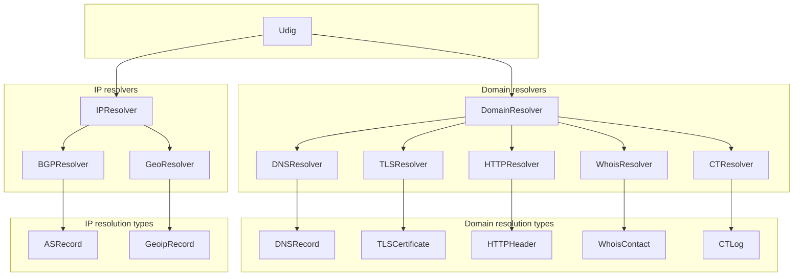

# Development

### Basic usage

Import the package:

```bash
go get github.com/netrixone/udig
```

```go
dig := udig.NewUdig()
for res := range dig.Resolve("example.com") {
    fmt.Println(res.Type(), res.Query())
}
```

Results are streamed through a channel as they become available — there is no need to wait for all resolvers to finish before processing output.

### Configuration

udig uses functional options for configuration:

```go
dig := udig.NewUdig(
    udig.WithDebugLogging(),
    udig.WithStrictMode(),
    udig.WithTimeout(30 * time.Second),
    udig.WithCTSince(time.Date(2024, 1, 1, 0, 0, 0, 0, time.UTC)),
    udig.WithMaxDepth(3),
)
```


| Option               | Effect                                                    |
| -------------------- | --------------------------------------------------------- |
| `WithDebugLogging()` | Enable verbose debug output                               |
| `WithStrictMode()`   | Only follow domains that share the same TLD               |
| `WithTimeout(d)`     | Set connection timeout for all resolvers                  |
| `WithCTSince(t)`     | Only collect CT logs issued after this date               |
| `WithCTExpired()`    | Include expired CT log entries                             |
| `WithMaxDepth(n)`    | Limit recursive discovery to n hops from seed (-1 = unlimited) |


### Working with resolutions

Each resolver produces a typed resolution. Use a type switch to handle them:

```go
for res := range dig.Resolve("example.com") {
    switch res.Type() {
    case udig.TypeDNS:
        for _, rr := range res.(*udig.DNSResolution).Records {
            fmt.Printf("DNS %s %s -> %s\n", dns.TypeToString[rr.QueryType], res.Query(), rr.Record)
        }
    case udig.TypeTLS:
        for _, cert := range res.(*udig.TLSResolution).Certificates {
            fmt.Printf("TLS %s -> %s\n", res.Query(), cert.Subject.CommonName)
        }
    case udig.TypeBGP:
        for _, as := range res.(*udig.BGPResolution).Records {
            fmt.Printf("BGP %s -> AS%d %s\n", res.Query(), as.Number, as.Name)
        }
    // ... TypeWHOIS, TypeHTTP, TypeCT, TypeGEO
    }
}
```

Resolution types: `TypeDNS`, `TypeTLS`, `TypeWHOIS`, `TypeHTTP`, `TypeCT`, `TypeBGP`, `TypeGEO`.

## Architecture




### Resolution flow

1. A domain enters the processing queue.
2. All `DomainResolver` instances run **concurrently** (goroutines + `sync.WaitGroup`).
3. Discovered IPs are enqueued for `IPResolver` processing.
4. Discovered domains are checked for relatedness and recursively enqueued.
5. Deduplication ensures each domain and IP is only resolved once.

### Resolver overview


| File       | Resolver        | Resolves                                     | Data source              |
| ---------- | --------------- | -------------------------------------------- | ------------------------ |
| `dns.go`   | `DNSResolver`   | DNS records (A, AAAA, NS, MX, TXT, SOA, ...) | Local/custom nameservers |
| `tls.go`   | `TLSResolver`   | TLS certificate chains                       | Direct TLS handshake     |
| `whois.go` | `WhoisResolver` | WHOIS contacts                               | WHOIS protocol           |
| `http.go`  | `HTTPResolver`  | Security HTTP headers (CSP, CORS, Alt-Svc)   | HTTP/HTTPS requests      |
| `ct.go`    | `CTResolver`    | Certificate Transparency logs                | crt.sh JSON API          |
| `bgp.go`   | `BGPResolver`   | BGP AS records                               | Team Cymru DNS           |
| `geo.go`   | `GeoResolver`   | GeoIP country codes                          | IP2Location LITE DB      |


## Building

### Prerequisites

- Go 1.24+
- `make`
- `wget` and `unzip` (for `make geoip` — optional GeoIP database)
- `upx` (only for `make release`)

### Make targets


| Target          | Description                                           |
| --------------- | ----------------------------------------------------- |
| `make`          | Build and run tests (default)                         |
| `make build`    | Compile binary                                        |
| `make test`     | Run tests                                             |
| `make test-race`| Run tests with race detector                          |
| `make install`  | Run tests, install binary, copy GeoIP DB if present   |
| `make release`  | Stripped + UPX release binary                         |
| `make clean`    | Remove binaries, GeoIP DB, test cache                  |
| `make fmt`      | Format code                                           |
| `make vet`      | Run `go vet`                                          |
| `make lint`     | Run golangci-lint                                     |
| `make mod-tidy` | Tidy go.mod / go.sum                                  |
| `make geoip`    | Download GeoIP database if missing                    |
| `make help`     | List targets                                          |


### Running tests

```bash
make test
# or directly:
go test -v ./...
```

## Key files


| File               | Purpose                                                   |
| ------------------ | --------------------------------------------------------- |
| `api.go`           | Interfaces, types, resolution structs, functional options |
| `udig.go`          | Facade implementation, queue processing, domain crawling  |
| `utils.go`         | Domain/IP regex extraction, domain relation heuristics    |
| `log.go`           | Colorized logging with log levels                         |
| `cmd/udig/main.go` | CLI entry point, argument parsing, output formatting      |


