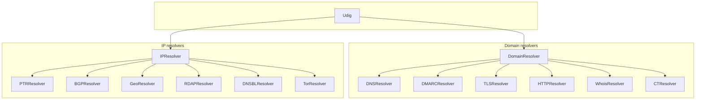

# Development

## Using udig as a library

### Basic usage

Import the package:

```bash
go get github.com/netrixone/udig
```

```go
dig := udig.NewUdig()
for res := range dig.Resolve(context.Background(), "example.com") {
    fmt.Println(res.Type(), res.Query())
}
```

Results are streamed through a channel as they become available — there is no need to wait for all resolvers to finish before processing output.

### Configuration

udig uses functional options for configuration:

```go
dig := udig.NewUdig(
    udig.WithDebugLogging(),
    udig.WithStrictMode(),
    udig.WithTimeout(30 * time.Second),
    udig.WithCTSince(time.Date(2024, 1, 1, 0, 0, 0, 0, time.UTC)),
    udig.WithMaxDepth(3),
)
```

| Option               | Effect                                                          |
| -------------------- | --------------------------------------------------------------- |
| `WithDebugLogging()` | Enable verbose debug output                                     |
| `WithStrictMode()`   | Only follow domains that share the same TLD                     |
| `WithTimeout(d)`     | Set connection timeout for all resolvers                        |
| `WithCTSince(t)`     | Only collect CT logs issued after this date                     |
| `WithCTExpired()`    | Include expired CT log entries                                  |
| `WithMaxDepth(n)`    | Limit recursive discovery to n hops from seed (-1 = unlimited) |

### Working with resolutions

Each resolver produces typed resolutions. Every resolution carries exactly one result (one type, one query, one record). Use a type switch to handle them:

```go
for res := range dig.Resolve(context.Background(), "example.com") {
    switch res.Type() {
    case udig.TypeDNS:
        record := res.(*udig.DNSResolution).Record
        fmt.Printf("DNS %s %s -> %s\n", dns.TypeToString[record.QueryType], res.Query(), record)

    case udig.TypeTLS:
        record := &res.(*udig.TLSResolution).Record
        fmt.Printf("TLS %s -> %s\n", res.Query(), record.Subject.CommonName)

    case udig.TypeBGP:
        record := &res.(*udig.BGPResolution).Record
        fmt.Printf("BGP %s -> AS%d %s\n", res.Query(), record.ASN, record.Name)

    case udig.TypeGEO:
        record := res.(*udig.GeoResolution).Record
        fmt.Printf("GEO %s -> %s\n", res.Query(), record.CountryCode)

    case udig.TypePTR:
        record := res.(*udig.PTRResolution).Record
        fmt.Printf("PTR %s -> %s\n", res.Query(), record.Hostname)

    case udig.TypeRDAP:
        record := &res.(*udig.RDAPResolution).Record
        fmt.Printf("RDAP %s -> %s (%s)\n", res.Query(), record.Name, record.Handle)

    case udig.TypeDNSBL:
        // Emitted only when the IP is listed; record.Zone + record.Meaning describe the listing.
        record := &res.(*udig.DNSBLResolution).Record
        fmt.Printf("DNSBL %s -> %s\n", res.Query(), record)

    case udig.TypeTor:
        // Emitted when the IP is any known Tor relay (exit, guard, middle, …).
        record := res.(*udig.TorResolution).Record
        fmt.Printf("TOR %s -> %s (exit=%v)\n", res.Query(), record.Nickname, record.IsExitNode())

    // ... TypeWHOIS, TypeHTTP, TypeCT, TypeDMARC
    }
}
```

Resolution types: `TypeDNS`, `TypeDMARC`, `TypeTLS`, `TypeWHOIS`, `TypeHTTP`, `TypeCT`, `TypePTR`, `TypeBGP`, `TypeGEO`, `TypeRDAP`, `TypeDNSBL`, `TypeTor`.

## Architecture


```mermaid
flowchart TB
  subgraph facade[" "]
    Udig[Udig]
  end

  subgraph domain["Domain resolvers"]
    DR[DomainResolver]
    DNS[DNSResolver]
    DMARC[DMARCResolver]
    TLS[TLSResolver]
    HTTP[HTTPResolver]
    WHOIS[WhoisResolver]
    CT[CTResolver]
  end

  subgraph ip["IP resolvers"]
    IR[IPResolver]
    PTR[PTRResolver]
    BGP[BGPResolver]
    Geo[GeoResolver]
    RDAP[RDAPResolver]
    DNSBL[DNSBLResolver]
    Tor[TorResolver]
  end

  Udig --> DR & IR
  DR --> DNS & DMARC & TLS & HTTP & WHOIS & CT
  IR --> PTR & BGP & Geo & RDAP & DNSBL & Tor
```

### Resolution flow

1. A domain enters the processing queue.
2. All `DomainResolver` instances run **concurrently** (goroutines + `sync.WaitGroup`).
3. Discovered IPs are enqueued for `IPResolver` processing.
4. Discovered domains are checked for relatedness and recursively enqueued.
5. Deduplication ensures each domain and IP is resolved only once.

### Resolver overview

| Resolver file         | Resolver          | Resolves                                      | Data source                      |
| --------------------- | ----------------- | --------------------------------------------- | -------------------------------- |
| `dns_resolver.go`     | `DNSResolver`     | DNS records (A, AAAA, NS, MX, TXT, SOA, ...)  | Local/custom nameservers         |
| `dmarc_resolver.go`   | `DMARCResolver`   | DMARC policy and reporting addresses          | DNS TXT `_dmarc.{domain}`        |
| `tls_resolver.go`     | `TLSResolver`     | TLS certificate chains                        | Direct TLS handshake             |
| `whois_resolver.go`   | `WhoisResolver`   | WHOIS contacts                                | WHOIS protocol                   |
| `http_resolver.go`    | `HTTPResolver`    | Security HTTP headers, security.txt, robots   | HTTP/HTTPS requests              |
| `ct_resolver.go`      | `CTResolver`      | Certificate Transparency logs                 | crt.sh JSON API                  |
| `ptr_resolver.go`     | `PTRResolver`     | Reverse DNS hostnames                         | DNS PTR records                  |
| `bgp_resolver.go`     | `BGPResolver`     | BGP AS records                                | Team Cymru DNS                   |
| `geo_resolver.go`     | `GeoResolver`     | GeoIP country codes                           | IP2Location LITE DB              |
| `rdap_resolver.go`    | `RDAPResolver`    | IP registration metadata                      | RIR RDAP via IANA bootstrap      |
| `dnsbl_resolver.go`   | `DNSBLResolver`   | DNS blocklist checks (listed zones + meaning) | Barracuda, UCEProtect, DroneBL   |
| `tor_resolver.go`     | `TorResolver`     | Tor node detection (exit/guard/relay)         | Tor Onionoo HTTPS API            |

### Adding a new resolver

1. Create `{name}.go` — define `{Name}Resolution` embedding `*ResolutionBase` with a single `Record {Name}Record` field, and `{Name}Record` with a `String()` method.
2. Create `{name}_resolver.go` — implement `ResolveIP(ip string) []Resolution` or `ResolveDomain(domain string) []Resolution`, plus `Type() ResolutionType`.
3. Add a `Type{Name}` constant to `api.go`.
4. Register it in `NewUdig()` in `udig.go`.
5. Handle the new type in the `switch` in `cmd/udig/main.go` and `cmd/udig/graph/graph.go`.
6. Add tests in `{name}_test.go`.

## Building

### Prerequisites

- Go 1.24+
- `make`
- `wget` and `unzip` (for `make geoip` — optional GeoIP database)
- `upx` (only for `make release`)

### Make targets

| Target           | Description                                           |
| ---------------- | ----------------------------------------------------- |
| `make`           | Build and run tests (default)                         |
| `make build`     | Compile binary                                        |
| `make test`      | Run tests                                             |
| `make test-race` | Run tests with race detector                          |
| `make install`   | Run tests, install binary, copy GeoIP DB if present   |
| `make release`   | Stripped + UPX release binary                         |
| `make clean`     | Remove binaries, GeoIP DB, test cache                 |
| `make fmt`       | Format code                                           |
| `make vet`       | Run `go vet`                                          |
| `make lint`      | Run golangci-lint                                     |
| `make mod-tidy`  | Tidy go.mod / go.sum                                  |
| `make geoip`     | Download GeoIP database if missing                    |
| `make help`      | List targets                                          |

### Running tests

```bash
make test
# or directly:
go test -v ./...
```

## Key files

| File                  | Purpose                                                   |
| --------------------- | --------------------------------------------------------- |
| `api.go`              | Interfaces, resolution types, `ResolutionBase`, constants |
| `udig.go`             | Facade, queue processing, domain crawling, `NewUdig()`    |
| `utils.go`            | Domain/IP regex extraction, domain relation heuristics    |
| `log.go`              | Colorized logging with log levels                         |
| `cmd/udig/main.go`    | CLI entry point, argument parsing, output formatting      |
| `cmd/udig/graph/`     | Graph output: DOT, JSON, terminal tree                    |
